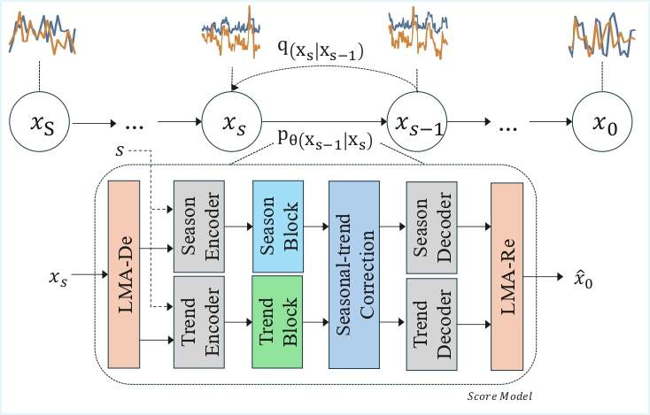

# STDiffusion (ICDM 2025)


Official implementation for STDiffusion, published in ICDM 2025.

## Authors
Zixuan Ma, Chenfeng Huang



> Denoising diffusion probabilistic models (DDPMs) are becoming the leading paradigm for generative models. It has recently shown breakthroughs in audio synthesis, time series imputation and forecasting. In this paper, we propose Diffusion-TS, a novel diffusion-based framework that generates multivariate time series samples of high quality by using an encoder-decoder transformer with disentangled temporal representations, in which the decomposition technique guides Diffusion-TS to capture the semantic meaning of time series while transformers mine detailed sequential information from the noisy model input. Different from existing diffusion-based approaches, we train the model to directly reconstruct the sample instead of the noise in each diffusion step, combining a Fourier-based loss term. Diffusion-TS is expected to generate time series satisfying both interpretability and realness. In addition, it is shown that the proposed Diffusion-TS can be easily extended to conditional generation tasks, such as forecasting and imputation, without any model changes. This also motivates us to further explore the performance of Diffusion-TS under irregular settings. Finally, through qualitative and quantitative experiments, results show that Diffusion-TS achieves the state-of-the-art results on various realistic analyses of time series. 


## Installation

### 1. Clone Repository
```bash
git clone https://github.com/mobkageyama/STDiffusion.git
cd STDiffusion
```
### 2. Dataset Setup
Download the required datasets from [Google Drive](https://drive.google.com/drive/folders/1CfHXyLcJw9FTwiF3QC9izD0qBzldqfAh?usp=sharing)


Place the downloaded files in the `datasets/` directory. The structure should look like:
```
datasets/
├── energy.csv
├── ETTh1.csv
├── ETTh2.csv
├── exchange_rate.csv
├── fmri.csv
├── occupancy.csv
├── stock.csv
└── weather.csv
```


### 3. Environment Setup
```bash
# Create and activate conda environment
conda create -n STDiffusion python=3.8
conda activate STDiffusion

# Install dependencies
pip install -r requirements.txt
```

## Model Training and Sampling

### Training
Start training using the provided script:
```bash
sh train.sh
```

### Sampling
Generate samples using:
```bash
sh sample.sh
```

### Command Format
```bash
python models/trainer.py \
    --config <configuration_filename> \
    --seed <your_luck_number> \
    --note <custom_label> \
    --action <train or sample>
```

### Command Parameters
- `config`: Configuration file path (e.g., `config/ETTh1.yaml`)
- `seed`: Random seed for reproducibility
- `note`: Custom label for the experiment
- `action`: Choose between `train` or `sample`

### Output Directories
- **Training checkpoints**: `./saved_models/`
- **Generated samples**: `./generated_datasets/`

## Configuration Files
The `config/` directory contains YAML configuration files for different datasets:


### Standard Configurations
- `ETTh1.yaml`, `ETTh2.yaml` - Electricity Transformer Temperature datasets
- `exchange_rate.yaml` - Exchange rate data
- `energy.yaml` - Energy consumption data  
- `weather.yaml` - Weather forecasting data
- `stock.yaml` - Stock market data
- `occupancy.yaml` - Room occupancy detection
- `fMRI.yaml` - Functional MRI data

### Long-term Generation Configurations
- `ETTh1_longterm.yaml` - ETTh1 dataset for extended horizon 
- `ETTh2_longterm.yaml` - ETTh2 dataset for extended horizon   
- `exchange_rate_longterm.yaml` - Exchange rate data for long-term generation tasks

These long-term configurations are optimized for generating longer sequences and extended horizons.

### Evaluations

The `evaluations/` directory contains comprehensive experiment results and evaluation scripts reported in the paper:

#### Evaluation Scripts
- `context_fid.py` - Context-aware Fréchet Inception Distance calculation
- `cross_correlation.py` - Cross-correlation analysis between generated and real data
- `discriminative_score_metrics.py` - Discriminative scoring metrics
- `predictive_score_metrics.py` - Predictive scoring evaluation
- `metric_utils.py` - Utility functions for metric calculations
- `data_loading.py` - Data loading utilities for evaluation
- `evaluation_part1.ipynb` - Main evaluation notebook (Part 1)
- `evaluation_part2.ipynb` - Main evaluation notebook (Part 2)

#### Experiment Records
- `Exp_records/` - Standard experiment results for all datasets
  - Contains detailed results for: energy, ETTh1, ETTh2, exchange_rate, fmri, occupancy, stock, weather
  - Each dataset has Part 1 and Part 2 experiment notebooks with comprehensive analysis

- `Exp_records_longterm/` - Long-term forecasting experiment results
  - Extended horizon experiments for ETTh1, ETTh2, and exchange_rate datasets
  - Results for different sequence lengths (64, 128, 256)
  - Includes `longterm_seq_generation_results.md` with summarized findings

These evaluation materials provide reproducible results and serve as reference implementations for the metrics and experiments described in the paper.


## Citation
If you use this code in your research, please cite:
```bibtex
@inproceedings{stdiffusion,
  title={STDiffusion: Structure-aware Time Series Generation with Diffusion Models},
  author={Ma, Zixuan and Huang, Chenfeng},
  booktitle={IEEE International Conference on Data Mining (ICDM)},
  year={2025}
}
```
